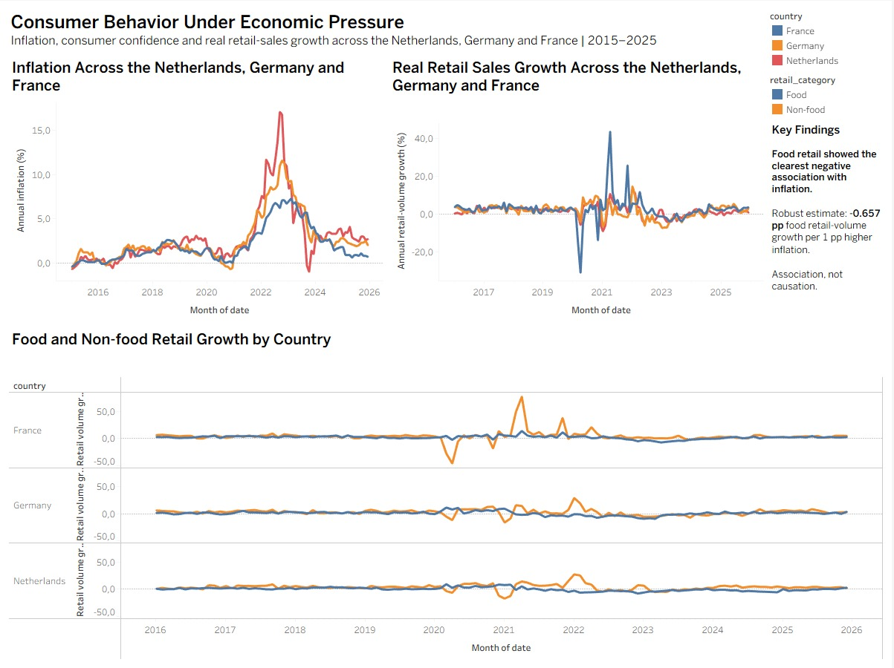
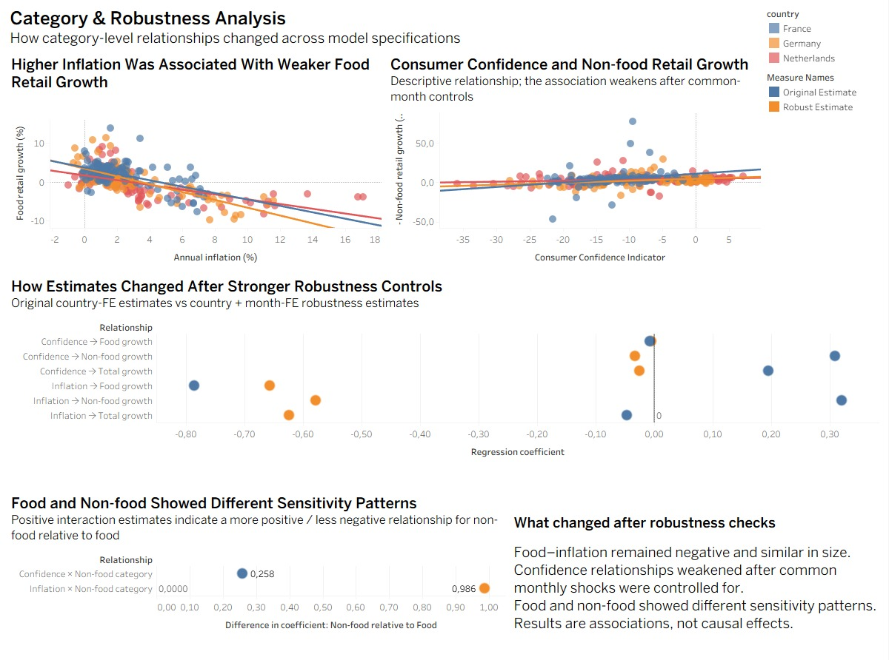

# Project Overview

This project looks at how inflation and consumer confidence were related to real retail sales growth in the Netherlands, Germany, and France between 2015 and 2025. The idea came from combining my economics background with practical data analysis using real-world European data. Rather than treating retail activity as a single measure, the analysis also separates food and non-food categories, since these types of purchases may not react in the same way when economic conditions become more difficult.

The main question is whether changes in inflation and consumer confidence are associated with changes in retail activity, and whether those relationships differ across product categories. Food purchases are generally harder to postpone, while some non-food purchases can be delayed or reduced, so I expected the two groups to show different patterns. Since the project uses observational data, the findings are interpreted as relationships between variables rather than evidence of causality.

## Data

The analysis uses monthly data from Eurostat and the European Commission for the Netherlands, Germany, and France, from January 2015 to December 2025. There are three main groups of variables in the dataset: annual HICP inflation, the Consumer Confidence Indicator, and retail sales volume for total retail, food, and non-food excluding automotive fuel. The full dataset has 396 country-month observations. Retail activity is measured with year-on-year growth instead of raw index levels. Each month is compared with the same month in the previous year. Because there is no previous-year comparison for 2015 inside the sample, the main regression models use 360 observations. Sales volume was used instead of nominal sales value because higher prices can increase nominal revenue, even when the actual amount of goods sold stays the same or falls.

| Variable | Description |
| --- | --- |
| Inflation | Annual HICP inflation rate |
| Consumer Confidence | European Commission Consumer Confidence Indicator |
| Total Retail | Total real retail sales volume |
| Food Retail | Food retail sales volume |
| Non-food Retail | Non-food retail sales volume excluding automotive fuel |

## Methodology

The analysis started with descriptive statistics and time-series charts, mainly to see how inflation, consumer confidence and retail growth moved over time. I then used Pearson and Spearman correlations to get a first view of the relationships between the variables. Regression models with country fixed effects came after that, so differences between the Netherlands, Germany and France would not be mixed directly into the main coefficients. Separate models were also run for each country. For food and non-food, I used interaction terms because comparing two separate regression results was not enough to see whether the categories were actually different from each other.

After the first regressions, I checked the model diagnostics and found serial dependence in the residuals. So the analysis did not stop with the original specification. I added panel models using Driscoll–Kraay standard errors, together with country and month fixed effects. The month effects were especially useful for periods where the three countries were exposed to similar European-wide conditions. I also reran part of the analysis without March 2020 to December 2021, since the COVID period had unusually large movements in retail data. Some results stayed quite close after these checks, but others, especially the consumer confidence results, changed noticeably.

## Main Findings

The clearest pattern appeared in food retail. In the first country fixed-effects model, the inflation coefficient was -0.786. After month fixed effects and the stronger panel specification were added, it stayed negative at -0.657, with a 95% confidence interval of [-1.179, -0.134]. The result changed less than several of the other estimates. Non-food growth, meanwhile, was much more volatile: its standard deviation was 7.75 percentage points, compared with 3.47 for food. The interaction estimates also pointed to a difference between the two categories, with Inflation × Non-food = +0.986 and Confidence × Non-food = +0.258. So the inflation relationship was less negative for non-food, while confidence was more positively related to non-food than to food. The confidence results were much less stable. The original coefficients were +0.195 for total retail and +0.309 for non-food, but after month fixed effects were added they moved to -0.025 and -0.033. That change is why I treated the confidence relationship more cautiously in the final interpretation.

### Food and Non-food Did Not Behave in the Same Way

The difference between food and non-food became clearer once I looked beyond the average growth rates. Non-food retail was much more volatile over the sample, with a standard deviation of 7.75 percentage points, while food was at 3.47. That gap was especially visible around the pandemic period, when non-food moved much more sharply. So even before looking at the regression results, the two categories were already showing quite different behaviour.

The interaction model added another layer to this. Inflation × Non-food was +0.986, meaning the inflation relationship for non-food was more positive, or less negative, than for food. The confidence interaction was +0.258, which points to a more positive confidence relationship in non-food. I originally expected non-food to be more sensitive to economic pressure in a general sense, but the result was more mixed than that: non-food was clearly more volatile, while the stronger negative inflation relationship appeared in food.

### Consumer Confidence and Robustness

Consumer confidence looked fairly important in the first set of models. At that stage, there seemed to be a positive relationship with retail growth, but this changed once month fixed effects were included. The estimates moved very close to zero, so I did not keep consumer confidence as one of the main findings in the final interpretation. A possible reason is that confidence and retail activity were both moving with broader economic conditions shared by the three countries. After controlling for more of these common monthly movements, the original positive relationship mostly disappeared. For me, this was one of the more useful parts of the analysis because the robustness check did not just support the first result, it actually changed it.

**Original coefficients**

- Total retail: +0.195
- Non-food retail: +0.309

**After month fixed effects**

- Total retail: -0.025
- Non-food retail: -0.033

## Visualisations / Tableau

### Dashboard 1 — Executive Overview

The first dashboard gives the general picture before moving into the regression results. The inflation trend shows a clear change after 2021, with inflation increasing strongly across all three countries and reaching its highest levels around 2022–2023. The Netherlands had the sharpest peak, while France increased less strongly. In the total retail growth chart, the biggest movements are concentrated around 2020 and 2021. Outside that period, retail growth stayed much closer to zero, which makes the pandemic years stand out from the rest of the sample. The food and non-food comparison also shows a clear category difference. Non-food moved much more sharply than food, especially in France during the pandemic and reopening period, while food growth remained relatively more stable across the three countries. This made it easier to see that the same economic period did not affect every retail category in the same way.

### Dashboard 2 — Category & Robustness Analysis

The second dashboard focuses more directly on the relationships found in the statistical analysis. In the inflation and food retail scatter plot, the trend lines slope downward for all three countries, which matches the negative inflation food relationship found in the regressions. The consumer confidence and non-food chart looks different. The raw relationship appears more positive, but the observations are more spread out and several extreme values are visible, especially around the pandemic period. The robustness coefficient comparison shows why the first regression results were not enough on their own. The food–inflation coefficient stays fairly close after the stronger specification, while the coefficients for consumer confidence and some of the broader retail relationships move much more. The category sensitivity chart presents the interaction results directly: Inflation × Non food is positive, so the inflation relationship is less negative for non-food than for food. Confidence × Non food is also positive, showing a more positive confidence relationship for non-food. This dashboard was useful for separating the results that stayed relatively stable from those that changed once stronger controls were added.

## Limitations

There are a few limits to what can be concluded from this project. The analysis is based on observational data, so the regression results should not be read as causal effects. It also covers only the Netherlands, Germany and France, which means the findings cannot automatically be extended to the rest of Europe. Another point is the outcome itself: retail sales volume is useful for measuring real retail activity, but it is not the same as total household consumption. Factors such as wages, unemployment, interest rates or fiscal support are also outside the model.

The category definitions create another limitation. Food and non-food are broad groups, so differences within each category are not visible here. The COVID period also produced unusually large movements in retail activity, especially for non-food. I checked part of the analysis without March 2020 to December 2021, but the period still matters when interpreting the full sample. Finally, the use of year-on-year growth creates overlapping observations, which is one reason serial dependence appeared in the regression diagnostics.

## Conclusion

The project ended up showing a more mixed picture than I expected at the beginning. The negative relationship between inflation and food retail-volume growth was the result that stayed most consistent across the different specifications, while non-food was clearly more volatile and showed a different pattern with consumer confidence. The confidence results changed the most during the analysis. They looked clearly positive in the first models, but once common monthly effects were added, the coefficients moved close to zero. That made me go back to the earlier interpretation and treat those first results more carefully. For me, this became one of the more important parts of the project because the stronger specification did not simply confirm the original model; it changed part of the story. It also made the category differences more important, since food and non-food did not react in the same way under the same economic conditions. In the end, the result I would rely on most is the negative inflation–food relationship, while the confidence findings need a much more cautious interpretation.

## Tools

`Python` · `pandas` · `NumPy` · `SciPy` · `statsmodels` · `linearmodels` · `Matplotlib` · `Jupyter` · `Tableau`
