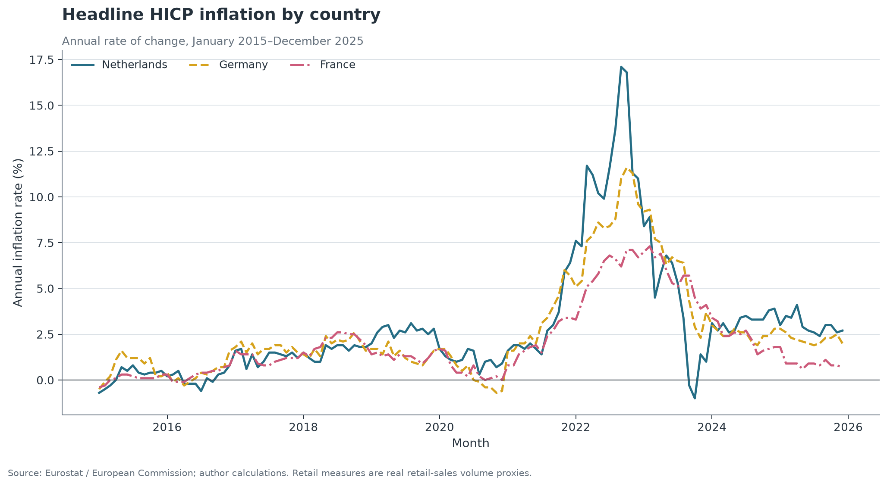
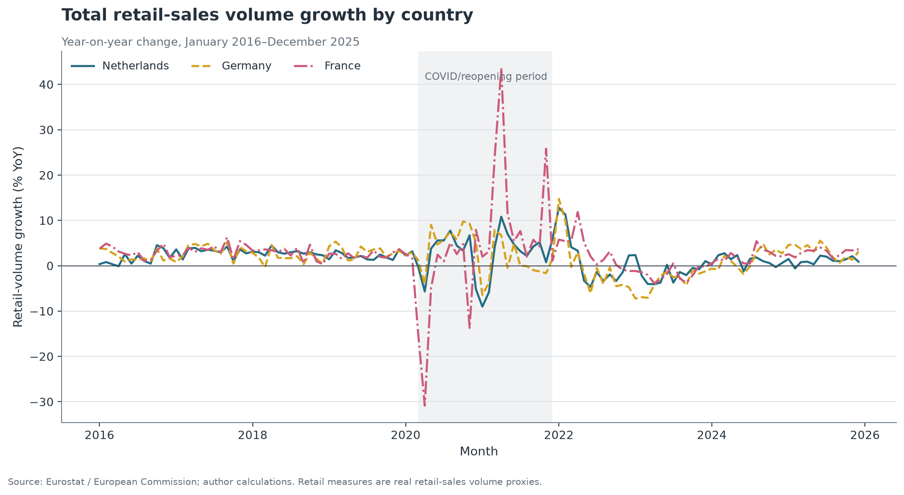
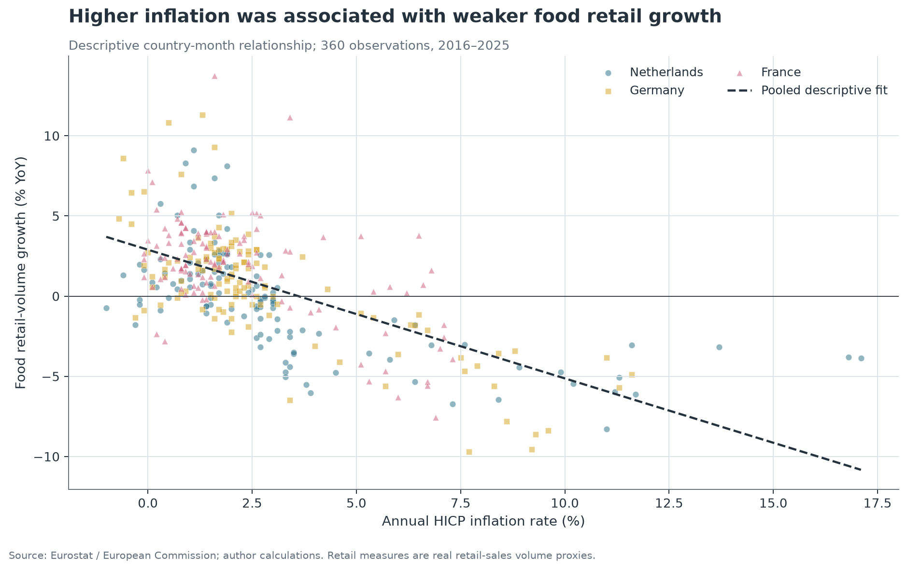
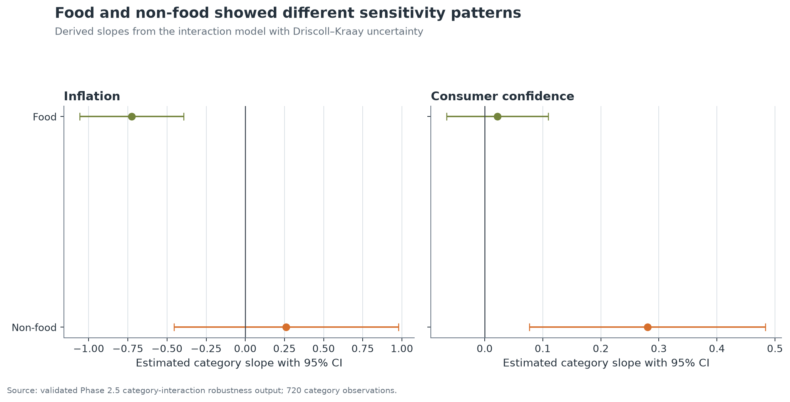
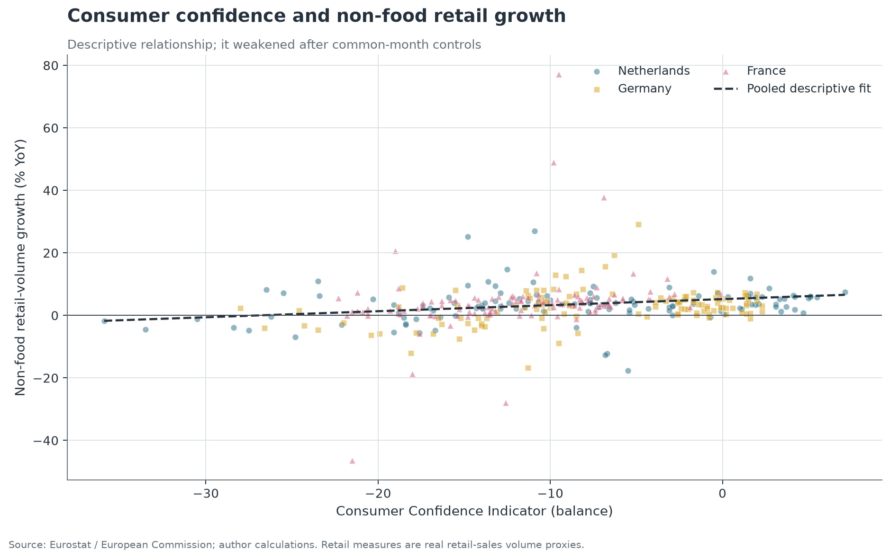
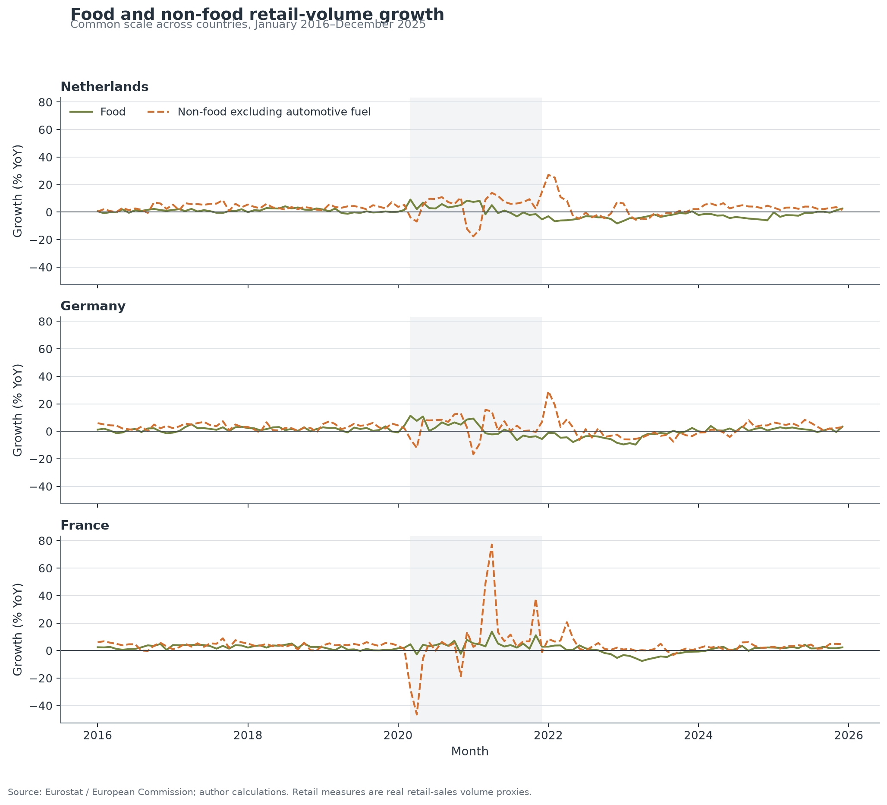
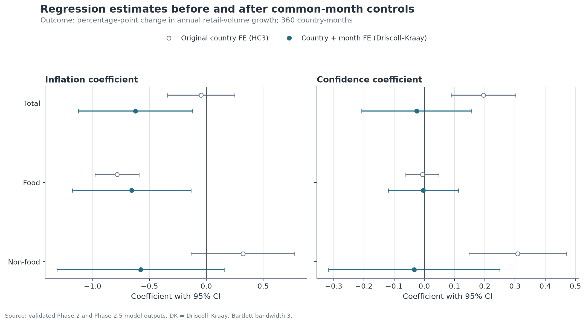

# Consumer Behavior Under Economic Pressure

## Executive Summary

This project asks how inflation and consumer confidence relate to real retail-sales growth in the Netherlands, Germany and France, and whether food and non-food retail respond differently. It uses monthly Eurostat data from January 2015 to December 2025. Retail activity is measured with volume-of-sales indices, so the results concern real retail activity rather than nominal expenditure.

The clearest result was the relationship between inflation and food retail-volume growth. In the original country fixed-effects model, the inflation coefficient was -0.786. After adding common monthly effects and using standard errors that account for serial and cross-country dependence, the coefficient was -0.657 with a 95% confidence interval from -1.179 to -0.134. A one-percentage-point increase in annual inflation was therefore associated with about 0.66 percentage points lower annual food retail-volume growth in the more conservative model.

Food and non-food also showed different sensitivity patterns. The robust interaction estimates were +0.986 for inflation × non-food and +0.258 for confidence × non-food. However, the original positive confidence relationships for total and non-food growth moved close to zero after common monthly effects were added. The analysis is observational, so these estimates describe associations rather than causal effects.

## 1. Question

**How do inflation and consumer confidence relate to real retail-sales growth across the Netherlands, Germany and France, and do food and non-food retail categories respond differently?**

The category comparison matters because aggregate retail can hide different movements underneath it. Food purchases are frequent and necessary, while non-food retail covers a broad set of more postponable products. The aim was not to assume a particular response in advance, but to test whether the two categories showed the same pattern during periods of inflation, weak confidence and unusual pandemic-related volatility.

## 2. Data

The project combines three official monthly Eurostat series for the Netherlands, Germany and France:

- headline HICP annual inflation;
- the seasonally adjusted Consumer Confidence Indicator;
- seasonally and calendar-adjusted retail volume indices for total retail, food, and non-food excluding automotive fuel.

The master dataset covers January 2015 to December 2025 and contains 396 country-month rows. Year-on-year retail growth begins in January 2016 because each calculation needs the same month one year earlier. This leaves 360 observations for the main models.

Retail volume is a proxy for real retail activity. It is not nominal turnover and does not cover all household consumption. This distinction matters because inflation can raise the amount paid even when the physical volume purchased is flat or falling.

Inflation was relatively low for much of 2015–2020, then rose sharply after 2021. The Netherlands reached the highest peak, followed by Germany and France. These shared movements are one reason the final robustness models include a fixed effect for every month.

## 3. Method

Retail growth was calculated as the percentage change in each volume index from the same month one year earlier. The analysis started with descriptive statistics, Pearson and Spearman correlations, and short lag comparisons. It then used regressions with country fixed effects, separate country models, and an interaction model comparing food with non-food. A pre-specified check excluded the main COVID and reopening period without deleting it from the primary sample.

The first pooled regressions used HC3 standard errors. Residual checks later showed clear serial dependence, and the three countries also share European shocks. A separate panel robustness phase therefore used country fixed effects with Driscoll–Kraay uncertainty, followed by a stricter model with both country and month fixed effects. The second model compares countries within the same month and absorbs shocks shared across all three.

This sequence was important: the original results were preserved, then tested under stronger assumptions. No additional predictors or countries were added, and the robustness bandwidth was fixed at three months rather than selected after seeing the results.

## 4. What the Data Looked Like

Average annual inflation was 2.53%, while the average Consumer Confidence Indicator was -8.95 balance points. Total retail-volume growth averaged 2.02% per year. Food growth averaged 0.69%, compared with 3.39% for non-food excluding automotive fuel.

The main difference was volatility. The standard deviation of non-food growth was 7.75 percentage points, more than twice the food figure of 3.47. Non-food ranged from -46.5% to 77.1%, while food ranged from -9.7% to 13.7%. Most of the very large non-food movements occurred during pandemic restrictions and reopening.

The total-growth chart shows why average values are not enough. France had especially large falls and rebounds, while later years were much less extreme. The unusual observations were kept because they were real events, then handled through explicit sensitivity and robustness checks.

## 5. Main Result: Inflation and Food Retail

The negative food–inflation relationship was the strongest and most stable finding. The original pooled country fixed-effects coefficient was -0.786. In the model with country and month fixed effects, it was -0.657, with a 95% confidence interval from -1.179 to -0.134.

In plain language, a one-percentage-point increase in annual inflation was associated with roughly 0.66 percentage points lower annual food retail-volume growth in the more conservative specification. The estimate stayed negative after common European monthly shocks were removed, and separate country regressions also produced negative food-inflation coefficients for the Netherlands, Germany and France.

The scatter plot shows the raw country-month pattern, while the regression estimate accounts for the model controls. Neither result means that inflation caused food growth to fall. Other conditions can move at the same time, and the data do not identify a causal mechanism.

## 6. Food and Non-Food Behaved Differently

The interaction model tested whether the inflation and confidence slopes differed between food and non-food. With the serial-dependence robustness treatment, inflation × non-food was +0.986 with a 95% confidence interval from +0.182 to +1.790. Confidence × non-food was +0.258 with an interval from +0.032 to +0.485.

The positive inflation interaction does not mean that inflation clearly improved non-food growth. It means the non-food slope was less negative than the food slope. The derived inflation slopes were -0.725 for food and +0.261 for non-food, but the non-food interval crossed zero. For confidence, the derived slopes were +0.022 for food and +0.280 for non-food.

The practical reading is that food showed the stronger negative inflation association, while non-food showed the stronger positive confidence association relative to food. These are category differences, not claims about individual consumers or motives.

## 7. Consumer Confidence

The confidence result changed after stronger controls were added. In the original country fixed-effects models, confidence was positively associated with total growth (+0.195) and non-food growth (+0.309). Both 95% intervals excluded zero.

After month fixed effects were added, the total coefficient moved to -0.025 with a 95% interval from -0.207 to +0.156. The non-food coefficient moved to -0.033 with an interval from -0.316 to +0.250. Both were close to zero and imprecise.

This is not a failed result. It shows why the robustness step was needed. The original positive pattern may partly reflect conditions that affected confidence and retail activity across Europe at the same time. The project therefore does not headline confidence as an independent driver of retail growth.

## 8. Country Differences

Country models showed that the aggregate relationships were not uniform. The food-inflation coefficient was negative in every country: -0.539 in the Netherlands, -1.283 in Germany and -0.647 in France. In contrast, total-inflation coefficients differed in direction, with estimates of +0.123, -0.691 and +0.366, respectively.

Confidence relationships also varied. Total-growth confidence estimates were +0.165 in the Netherlands, +0.046 in Germany and +0.509 in France. These values are descriptive differences rather than a formal country ranking.

The country panels make the main contrast visible: non-food growth moved much more sharply than food growth, particularly in France during 2020–2021. The shared scale prevents the calmer series from appearing equally volatile.

## 9. Robustness

The analytical sequence was deliberately simple:

1. Estimate the initial country fixed-effects models.
2. Check residual behaviour and identify serial dependence.
3. Repeat the models without March 2020–December 2021 as a sensitivity check.
4. Re-estimate uncertainty using a panel method suited to serial and cross-country dependence.
5. Add month fixed effects to absorb shocks shared across the three countries.
6. Compare direction, magnitude and uncertainty rather than focusing only on p-values.

Food inflation stayed negative and similar in size. Food confidence stayed close to zero. Total inflation changed from -0.046 to -0.624 and should be described as specification-sensitive, even though its final confidence interval excluded zero. Total and non-food confidence also changed materially and moved near zero. With only three countries, the month-effect model is demanding and should be treated as a strong stress test rather than a final causal specification.

## 10. Business Interpretation

The analysis supports four restrained implications. First, category-level retail monitoring can reveal relationships hidden by total retail. Second, food and non-food should not automatically be assumed to respond in the same way to macroeconomic pressure. Third, inflation and confidence can provide useful external context when a business reviews category-level volume movements. Fourth, sentiment relationships should be checked against common macroeconomic shocks before they are treated as stable.

For a dashboard, this means economic indicators should sit beside category-level retail measures, not replace them. The robustness comparison should also remain visible so that a descriptive pattern is not presented as a settled relationship. The evidence does not support a specific pricing, inventory or promotion decision.

## 11. Limitations

- The data are observational and do not support causal inference.
- Only three countries are included.
- Retail volume is not total household consumption or nominal expenditure.
- Other macroeconomic variables are omitted.
- Shared European shocks may not be fully captured.
- Food and non-food are broad categories.
- Pandemic and reopening months created extreme observations.
- Overlapping year-on-year growth rates create serial dependence.
- Results may not generalise to other countries or periods.

## 12. Conclusion

Economic pressure did not relate to all retail categories in the same way. The most stable result was the negative association between inflation and food retail-volume growth: the coefficient remained close in size after country and month effects were included. Food and non-food also differed in their inflation and confidence slopes. Other findings were less stable. In particular, the original positive confidence relationships for total and non-food growth disappeared once shared monthly shocks were controlled for, while the total-inflation estimate changed sharply. The main value of the project is therefore not a single universal claim. It is the combination of category-level analysis, transparent mixed results, and a robustness process that changed the final interpretation where the evidence required it.

